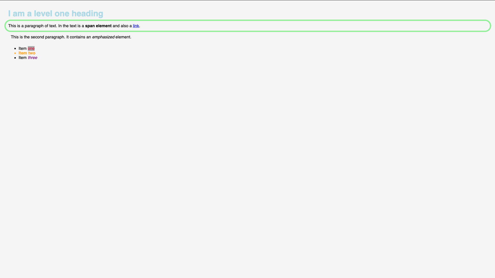

# Exercise 2

In this exercise we will style various pre-written HTML elements to make them look like the following image:



The challenge is to find the proper CSS styles to apply to the proper elements. You should not change the HTML in any
way. You can reference the list of possible CSS styles here:
<https://developer.mozilla.org/en-US/docs/Web/CSS/Reference>

## Requirements

The application should have the following requirements:

-   The application should be a web application
-   The application HTML code should not be changed
-   The styling should be in the `index.css` file
-   The application should exist of at least 2 files: `index.html` and `index.css`
    -   The application **should not** embed the JavaScript and CSS inside the HTML file.
-   The background-color of the whole page doesn't have to be exactly correct, but it should be a light grey color.
-   Overall the CSS doesn't have to exactly match, but try to get as close as possible. If you want to know if you are
    close enough, you can ask the instructor to check your work.

## Hints

1. Ideally you will do this exercise by running the application locally. However, if you face issues doing this you can
   follow this URL to do it online: https://codesandbox.io/s/2-css-styling-dm4whl

2. If you already have NodeJS installed then you can start a server with live reloading by running the following command
   in the root directory of this repository:

    ```bash
    npm run ex2
    ```

3. It is recommended to download/clone this repository as a starting point for this exercise, the `index.html` and
   `index.css` files in this folder are already set up for you.

4. You should not need to use any JavaScript for this exercise, only CSS.

5. You can keep the CSS code that is already provided in the `index.css` file. This is code that isn't relevant for this
   exercise, but is here so your page is a bit easier to read.
